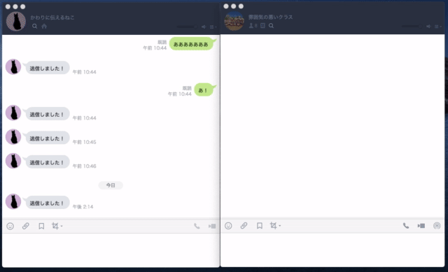

# 匿名LINEBot かわりに伝えるねこ
<p align='center'>
    
</p>
<p align='center'>QRコード: https://qr-official.line.me/sid/L/278masrf.png</p>


## 概要
第1回合同ハッカソン with プロ研, C3, コン研でのプロダクトです.  
優秀賞(2位)を頂きました.  
このBotに個人チャットでメッセージを送ると, 特定のグループで代わりに発言してくれます.  
## テーマ
アイスブレイク
## 開発環境
| tool       | version |
|------------|---------|
| node.js    | -       |
| yarn       | -       |
| heroku cli | -       |
| ngrok      | -       |

## 開発方法
リポジトリをクローンする  
```bash
git clone https://github.com/FukeKazki/Hackathon_1.git
```

モジュールのインストール
```bash
yarn install
```

### <キックオフ>
1. 課題に応じてissueを立てる
2. GitHubのissueを元に開発ブランチをmasterブランチから切る  
切る前にはmasterブランチを最新にしておく(pull)  

最新(pull)の仕方
```bash
git pull origin master
```

今いるブランチの確認
```bash
git status
```

ブランチの切り方
```bash
git checkout -b 新しいブランチの名
```

ブランチの切り替え
```bash
git checkout 切り替え先のブランチ名
```
### <開発中>
- 質問はslackやissueへのコメントへどうぞ  
- 実装ができたら ngrok を使って動作確認をする  
```bash
yarn start
ngrok http 3000
```

### <開発完了>
- 動作が正しく行われたらGitHubに上げる
```bash
git add .
git commit -m "メッセージ"
git push origin 今作業してるブランチ名
```
- pushまで完了したらGitHubで "今作業してるブランチ" から "masterブランチ" へ PullRequest を送る  
- PullRequestが通ったら <キックオフ> へ戻る

## 便利リンク集
### **LINEBOT関連**
- [Node.jsで作る資料](https://qiita.com/n0bisuke/items/ceaa09ef8898bee8369d)  
- [LINE BOTをNode.jsで作る](https://qiita.com/Hirosaji/items/4c136c13660bb1217662)  
- [Heroku](https://dashboard.heroku.com/apps)  
- [LINE Developers メッセージタイプ](https://developers.line.biz/ja/docs/messaging-api/message-types/#text-messages)  
- [画像つきでわかりやすいAPI解説](https://qiita.com/kakakaori830/items/52e52d969800de61ce28)  
### **JavaScript関連**
- [チートシート(便利すぎて誰にも教えたくなかったけどしょうがないから教える)](https://jsprimer.net/cheetsheet/)  
- [JSのナウい書き方](https://qiita.com/shibukawa/items/19ab5c381bbb2e09d0d9)  

### **Git, GitHub関連**
- [Git超絶まとめ](https://qiita.com/masashi127/items/2e103c3fba9d1b058961)  

### **その他**
- [ngrok](https://qiita.com/kitaro0729/items/44214f9f81d3ebda58bd)  
